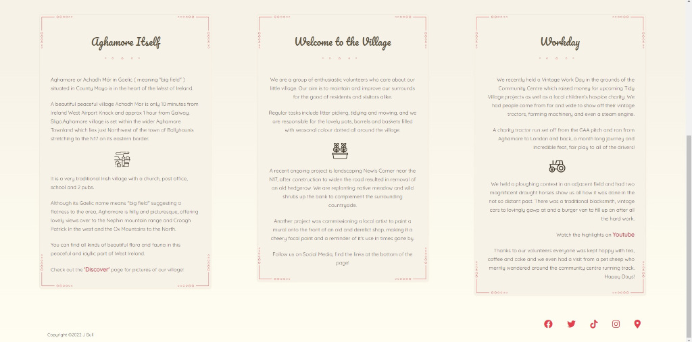

# Aghamore Tidy Village

The site is for a community group of volunteers and the organisation which helps keep their village tidy. 

Aghamore is a village in Mayo in the west of Ireland, and as with many rural village it is often overlooked by larger government bodies.  The Aghamore tidy village group seeks to rectify this by keeping the village, clean, tidy and well kept.  This site hopes to give a brief overview of the above, provide a gallery and a contact page for people to leave feedback.

The aim was to achieve a simple, retro styled yet modern website that was fully responsive whilst using no Javascript. Only pure HTML and CSS were used. Further to this the desire was to have slightly different layouts at various sizes in attempt to convey the same feeling regardless how it was viewed.

## Appearance of landing page on different devices

## Features

* ## Page Header

   * Contains a title with the groups name. This has been styled with offset shadow effects
   * On screen sizes above 820px in width consists of 3 buttons floated right with a simple animation when hovered. These show active page with an underline when clicked.
   * All elements are responsive at various sizes
   * The bunting (flags) effect is desinged to be asymmetrical, it shifts and scales at various screen sizes to remain in view but not to obscure anything vital.
   * Bunting was designed using inkscape by me. It is not present on the discover and contact pages.
   * Navigation elements are consistent across 3 pages

* Hamburger menu

   * On screen sizes below 820px the buttons are removed from view and replaced a with simple hamburger style menu. As detailed above this is pure css no javascript was used.
   * This screen size was originally 768px but following feedback from industry professional it was increased to 820px to account for larger tablets.

--------------------------------

* ## Hero Image / Landing section

   * Image of Aghamores main street with welcome button.
   * Welcome button auto navigates to the text content below (mainly for use on mobiles)
   * This image is wide and expansive and not suited to harsh scaling. As such css that increases the size of the image without effecting the contained is used to convery the same feel at various sizes.
   * Image created in gimp from photo taken by me and then optimised with [tingpng.com](http://tinypng.com)

--------------------------------

* ## Main page content & footer section

   * Consists of 3 main content blocks created using Flex boxes
   * The content of these boxes has been styled to be responsive at shift justification at different screen sizes
   * Each section has descriptive text 4 corner graphics, and underline graphic and an icon (done with svgs and pngs respectively)
   * the footer seen at the bottom has basic copyright data and links to social media (mostly basic links to the main pages of each site in this case but added for example purpose) it is designed to site below the sites content regardless of flex boxes above.
      * The footer is consistent across all 3 pages
   * The flow of this content was shifted following feedback from an industry professional. It now has the place information first and welcome / Intro message second.

--------------------------------

* ## Gallery page

   * Purpose of the page is to provide a grid based gallery that is fully responsive
   * Rather than shifting the layout the page merely responds by having each picture take up different amounts of rows and columns on resize
   * The images have a hover functionality which plays a short subtle flash animation to indicate interactivity
   * At higher than 1000px each image also has a subtle zoom effect on hover & click
   * Each image can be clicked to view in a larger format which then shows a caption. Clicking outside the image goes back to main gallery inline with expected function that most users will have experience of.
   * The page is built using pure css and html. The focus selector in CSS is used to zoom each image when clicked. When first implemented this resulted in ugly background shifts of the other images and unwanted interaction where clicking outside would result in a new image zoom rather than reverting the zoom. 
       * To fix this a background div was created that sits below all the content using z-index. On focus of an image this background div becomes visible and shifts up the z-index to cover everything, except the image that is zoomed and its respective caption.
       * This allows the user to click around the image without unwated interaction with the rest of the gallery, I did experiment with making this transparent but it was visually confusing.
    * Following feedback from an industry professional the zoom effect was removed from small screen devices as it was visually confusing.
    * Following feedback from a test user I had to remove the native 'lazy loading' tags in the html as they created a huge bug on Safari iOS 
    * Following feedback from an industry professional the gallery was edited to show less images on smaller devices to prevent excessive scrolling.
    

--------------------------------

* ## Contact page

   * Page has a simple form that allows users to post feedback with a rural background image (taken by me)
   * The form uses percentile width values and margins to remain centered
   * It's elements (labels & fields) are either inline or block depending on screen size to create a coherent layout at all sizes
   * It's content is responsive in terms of text and field size for smaller devices
   * The form has had its functionality removed and a very basic thank you page added to show it works as intended without ruining navigation flow.

--------------------------------

* ## Future roadmap

   * In future direct links to SM feeds would be inserted onto the front page in or below the about section
   * If deployed live as an active site with permissions the actual volunteers names and details would be displayed on a 4th page possiby a "Meet us" page. This seemed beyond the scope of this project but may yet be implemented.
   * Links would be made in the about section to the community development group (a larger organisation and fundraising team)

--------------------------------

* ## Testing phase

   * Early testing was getting the gallery and flex elements working correctly 
   * The flex elements on the main page worked fairly quickly and simply required some responsive design for differing screen sizes
   * The grid on the gallery page was problematic and required lots of testing of various values to make it display correctly at varying sizes. 
      * The masonry style layout was achieved using different size images 
   * Following a test users feedback the gallery had to have its native lazy image loading removed as it didn't display correctly on Safari iOS

--------------------------------
* ## Lessons learned
 
    * Getting the form to work with floated elements was problematic, this page in future could possibly use a redesign as it ended up being needlessly complex.
    * In future I would settle on one convetion for responsive CSS code and have each query done per major element.
    * Using JS would have made much of the functionality easier to achieve but for this project I wanted to achieve this with CSS and HTML only
    * Having a more coherent code style from page to page would be preferable in future. Hopefully by viewing the progression of the code you can see how my knowledge grew. Were I to start again I would approach the front page underlying somewhat differently, but the end result and actual look I am happy with.

--------------------------------

* ## Validator testing

   * HTML No errors were returned when passing through the official [w3c validator](https://validator.w3.org/nu/?doc=https%3A%2F%2Fjeffreybull76.github.io%2FCI_Project1%2Findex.html)
   * CSS No errors were returned when passing through the official [Jigsaw validator](https://jigsaw.w3.org/css-validator/validator?uri=https%3A%2F%2Fjeffreybull76.github.io%2FCI_Project1%2F&profile=css3svg&usermedium=all&warning=1&vextwarning=&lang=en)
   * Lighthouse test (see image)

   

      * main hits on performance were due to lacking cache policy - altering this was beyond the scope of this project.

--------------------------------

* ## Unfixed bugs

   * No bugs that I am aware of exist though testing (as with all live code) is ongoing

--------------------------------

* ## Deployment

   * The site was deployed to GitHub pages. The steps to deploy are as follows: 
   * In the GitHub repository, navigate to the Settings tab 
   * From the source section drop-down menu, select the Master Branch
   * Once the master branch has been selected, the page will be automatically refreshed with a detailed ribbon display to indicate the successful deployment. 
      * The live link can be found - [Here](https://jeffreybull76.github.io/CI_Project1/index.html)

--------------------------------

* ## Content

   * All text and images are original created by myself
   * The gallery was created by following numerous grid tutorials, itterating on those ideas at a base level to display images, and adding the pop up functionality
   * Hamburger icon from font awesome
   * Fonts from googlefonts

   
