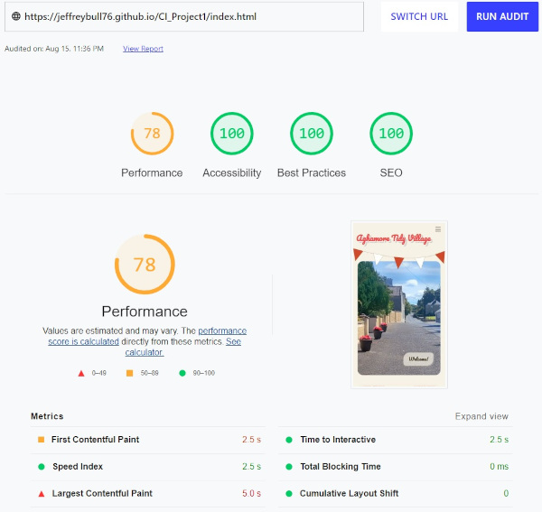

# **AGHAMORE TIDY VILLAGE**

The site is for a community group of volunteers and the organisation which helps keep their village tidy. 

The site is an imagined one for a real group that may require such a site in the near future. 
Upon completion of the course and with further work it may become a live site, and was designed with this in mind.

-----------------------------------------

## [**Table of Contents**](<#table-of-contents>)
   [**Early Concept / User Experience**](<#early-concept>)
   * [**Design Ethos**](<#design-ethos>)
   * [**Typography**](<#typography>)
   * [**Colors**](<#colors>)
   * [**Coding**](<#coding>)

## [**Development Process**](<#development-process-1>)
   * Git Commits
   * Code Comments

# [**FINAL DESIGN**](<#final-design-1>)

## [**Features**](<#features-1>)
   * [**Navigation**](<#navigation>)
   * [**Mobile Navigation**](<#mobile-navigation>)
   * [**Main Page**](<#main-page>)
      * [**Landing Section**](<#landing-section>)
      * [**About Section**](<#about-section>)
   * [**Discover Page**](<#discover-page>)
   * [**Contact Page**](<#contact-page>)
   * [**Future roadmap**](<#future-roadmap>)

## [**TECHNOLOGY**](<#technology-1>)
   * HTML5
   * CSS
   * Gitpod
   * Github
   * GIMP
   * Inkscape

## [**TESTING**](<#testing-1>)
   * [**W3C**](<#w3c>)
   * [**JIGSAW**](<#jigsaw>)
   * [**LIGHTHOUSE**](<#lighthouse>)
   * [**NOTES**](<#notes>)

## [**DEPLOYMENT**](<#deployment-1>)
   * To Deploy
   * To Fork
   * To Clone

## [**CONTENT**](<#content-1>)
   * Media
   * 3rd Party resources

## [**FINAL THOUGHTS**](<#final-thoughts-1>)
   * Lessons learned
   * Acknowledgements

## Early Concept

   * ### Design Ethos
   * Early on I decided to go with a fairly standard layout. The site is mainly aimed at local users and to provide the group with a central hub it can use when publicising itself, with charity events and fundraising (see roadmap future section below) I considered 3 main goals.
      * Not being to content heavy but just giving a general vibe about what the group is and the village they help to maintain.
      * Being easy for other users to maintain or add content to (no heavy use of scripting, made with pure css/html)
      * Being easy to iterate on later if the sites scope increases.
   * I considered but ultimately rejected a more cartoon / simplistic approach as it would have been to labour intensive creating all the images from scratch. Where as photo content is easier to produce and optimise for a first project.

Below you will see two early concepts quickly sketched using inkscape and gimp.

 

   * Eventually the final design incorporated elements of both ideas (see below) with a more retro but cleaner style applied. Only pure HTML and CSS were used (except for 1 instance of a font awesome script to add an icon for the mobile menu)  Further to this the desire was to have slightly different layouts at various sizes in an attempt to convey the same feeling regardless how it was viewed. The fonts were chosen to convey a subtle retro style without being to difficult to read. 
   * The layout was kept simple so I could display my grasp of responsive design. All the elements have been styled and tweaked according to size. By resizing in dev tools, you can see the content shift around at almost all sizes dynamically. In some cases reformatting, adding or removing content, changing animations and more dependant on size.

[Go back](<#table-of-contents>)
-----------------------------------------

 * ### Typography
   * Quicksand - is used for the main text of the site and main readable section
   * Pacifico - is used for more decorative headings that require impact 
   * Both were chosen to fit the somewhat retro feel

[Go back](<#table-of-contents>)
-----------------------------------------

 * ### Colors
    * A soft off white stone like color was chosen, along with a darker brown (nearly black) for the text
    * Red and white (the colors of the area of Aghamore) were used in the title and small design elements (flags, border graphics)

[Go back](<#table-of-contents>)
-----------------------------------------

 * ### Coding
    * All coding was done from scratch. Any templates, code snippets or tutorials were heavily modified and fully integrated by hand coding to function within the sites structure. No base code was copy pasted (except for boilerplate code) into the html or css files.

[Go back](<#table-of-contents>)
-----------------------------------------

* ### Development process
    * Git Commits - Being new to Git I wanted to keep my commits descriptive and do so often. In retrospect some are longer than is preferred but I hope they convey a sense of purpose. A labelling convention was used:
       * Maint: for maintenance or general code changes
       * Style: for large changes to layout or design elements
       * repair: for fixing errors I introduced
       * readme: for changes to the readme file
       * and so on
   * Code Comments - I have left comments in both the html and css files to give a sense of structure and make it easier for future developers to modify

[Go back](<#table-of-contents>)
-----------------------------------------

# **FINAL DESIGN**

## Features

* ### Navigation
   * Contains a title with the groups name. This has been styled with offset shadow effects
   * On screen sizes above 820px the navigation consists of 3 buttons floated right with a simple animation when hovered. These show active page with an underline effect.
   * All elements are responsive at various sizes
   * The bunting (flags) effect is desinged to be asymmetrical, it shifts and scales at various screen sizes to remain in view but not to obscure anything vital.
   * Bunting was designed using inkscape by me. It is not present on the discover and contact pages. It goes under and above certain elements by using z-index.
   * Navigation elements are consistent across 3 pages

[Go back](<#features>)
-----------------------------------------

* ### Mobile Navigation

  * On screen sizes below 820px the buttons are removed from view and replaced with a simple hamburger style menu. As detailed above this is pure css no javascript was used.
    * This is achieved with a navigation menu positioned off screen.
    * When the radio button is clicked (which is hidden and covered with a font awesome hamburger icon) the navigation slides into view.
    * The radio button itself is not present above 820px as already mentioned.
    * The radio button has an aria label as no real label is present (for accessability)
  * This screen size was originally 768px but following feedback from mentor it was increased to 820px to account for larger tablets. This also prevents the buttons clashing with other graphical elements on resize.

[Go back](<#features>)
-----------------------------------------

* ### Main Page
   * ### Landing section
     * Hero Image of Aghamores main street with welcome button.
     * Welcome button auto navigates to the text content below (mainly for use on mobiles)
     * This image is wide and expansive and not suited to harsh scaling or losing aspect ratio. Css styling that scales the image without effecting the container or aspect ratio is used to convey the same feel at various sizes.
     * Image created in gimp from photo taken by me and then optimised with [tingpng.com](http://tinypng.com)
     * Also features overlapping bunting effect (as detailed above)

[Go back](<#features>)
-----------------------------------------

   * ### About Section
      * Consists of 3 main content blocks created using Flex 
      *  The content of these boxes has been styled to be responsive at different screen sizes, including keeping its justification coherent as rows are added.
      * Each section has descriptive text, 4 corner graphics, underline graphic and an icon that sums up the content (done with svgs from 3rd party and hand built pngs respectively)
      * the footer seen at the bottom has basic copyright data and links to social media (mostly basic links to the main pages of each site in this case but added for example purpose) it is designed to sit below the sites content regardless of flex boxes above.
      * The footer is consistent across all 3 pages
      * The flow of this content was shifted following feedback from mentor. It now has the place information first and welcome / Intro message second.
      * At mobile screen size the content shifts back to have the welcome message first.
      * Future note: I did toy with the idea of having each box collapse down and resize to full on click. The text would then load in with an animation. While doing this with CSS was possible (using a similar focus technique I used on the gallery) it felt needlessly clunky for the main page and would have required hiding important text. Ultimately I decided against this. If the site ever went live I would revisit this idea but using a technology like javascript to implement it.

[Go back](<#features>)
--------------------------------

* ## Discover Page

   * Purpose of the page is to provide a grid based gallery that is fully responsive. Grid was used over flex as it offers greater control for the style of gallery I wanted, whilst still allowing a dynamic masonry style effect.
   * Rather than shifting the layout the page merely responds by having each picture take up different amounts of rows and columns on resize
   * The images have a hover functionality which plays a short subtle flash animation to indicate interactivity
   * At higher than 1000px each image also has a subtle zoom effect on hover & click
   * Each image can be clicked to view in a larger format which then shows a caption. Clicking outside the image goes back to main gallery inline with expected function that most users will have experience of.
   * The page is built using pure css and html. The focus selector in CSS is used to zoom each image when clicked. When first implemented this resulted in ugly background shifts of the other images and unwanted interaction where clicking outside would result in a new image zoom rather than reverting the zoom. 
       * To fix this a background div was created that sits below all the content using z-index. On focus of an image this background div becomes visible and shifts up the z-index to cover everything, except the image that is zoomed and its respective caption.
       * This allows the user to click around the image (allowing the image to then 'lose focus') without unwanted interaction with the rest of the gallery. I did experiment with making this transparent but it was visually confusing.
    * Following feedback from mentor the zoom effect was removed from small screen devices as it was visually confusing.
    * Following feedback from a test user I had to remove the native 'lazy loading' tags in the html as they created a huge bug on Safari iOS 
    * Following feedback from mentor the gallery was edited to show less images on smaller devices to prevent excessive scrolling.
    * If made into a live site this page would be subsectioned with different galleries relating to different events or themes, would also feature video clips of events.
    

[Go back](<#features>)
-----------------------------------------

* ## Contact Page

   * Page has a simple form that allows users to post feedback with a rural background image (taken by me)
   * The form uses percentile width values and margins to remain centered
   * It's elements (labels & fields) are either inline or block depending on screen size to create a coherent layout at all sizes
   * It's content is responsive in terms of text and field size for smaller devices
   * The form has had its functionality removed and a very basic thank you page added to show it works as intended without ruining navigation flow by going offsite. 
   * The 'Thank You' page was created following mentor feedback to prevent navigating off site but would not be part of a live site.
   * This page in a live version could be expanded to have details of the main volunteers who run the group (with their permission) 

[Go back](<#features>)
-----------------------------------------

* ## Future roadmap

   * Add a more efficient cache policy inline with lighthouse web test advice
   * Add easing animations on text and other elements to create a more flowing experience
   * The site may serve as a way for the group to publicise what it does and as a central hub to navigate to SM sites and would require the following added.
      * Direct links to SM feeds would be inserted onto the front page in or below the about section
      * If deployed live as an active site with permissions the actual volunteers names and details would be displayed on a 4th page or potentially as an addition to the contact page. This seemed beyond the scope of this project but may yet be implemented.
      * Links would be made in the about section to the community development group (a larger organisation and fundraising team)

[Go back](<#features>)
-----------------------------------------
* ## Technology

AMEND

[Go back](<#table-of-contents>)
-----------------------------------------

AMEND 

* ## Testing
   * Early testing was getting the gallery and flex elements working correctly 
   * The flex elements on the main page worked fairly quickly and simply required some responsive design for differing screen sizes
   * The grid on the gallery page was problematic and required lots of testing of various values to make it display correctly at varying sizes. 
      * The masonry style layout was achieved using different size images 
   * Following a test users feedback the gallery had to have its native lazy image loading removed as it didn't display correctly on Safari iOS

* ### Validator testing
   * HTML No errors were returned when passing through the official [w3c validator](https://validator.w3.org/nu/?doc=https%3A%2F%2Fjeffreybull76.github.io%2FCI_Project1%2Findex.html)
   * CSS No errors were returned when passing through the official [Jigsaw validator](https://jigsaw.w3.org/css-validator/validator?uri=https%3A%2F%2Fjeffreybull76.github.io%2FCI_Project1%2F&profile=css3svg&usermedium=all&warning=1&vextwarning=&lang=en)
   * Lighthouse test (see image)

   

      * main hits on performance were due to lacking cache policy - altering this was beyond the scope of this project.

* ### Unfixed bugs
   * No bugs that I am aware of exist though testing (as with all live code) is ongoing

[Go back](<#table-of-contents>)
-----------------------------------------

AMEND 

* ## Deployment

   * The site was deployed to GitHub pages. The steps to deploy are as follows: 
   * In the GitHub repository, navigate to the Settings tab 
   * From the source section drop-down menu, select the Master Branch
   * Once the master branch has been selected, the page will be automatically refreshed with a detailed ribbon display to indicate the successful deployment. 
      * The live link can be found - [Here](https://jeffreybull76.github.io/CI_Project1/index.html)

[Go back](<#table-of-contents>)
-----------------------------------------
AMEND 

* ## Content

   * All text and images are original created by myself
   * The gallery was created by following numerous grid tutorials, itterating on those ideas at a base level to display images, and adding the pop up functionality
   * Hamburger icon from font awesome
   * Fonts from googlefonts (Pacifico & Quicksand)
   * 3 icons on about section from [SVGrepo](https://svgrepo.com)

[Go back](<#table-of-contents>)
-----------------------------------------

* ## Final Thoughts
    * Lessons Learned
      * Getting the form to work with floated elements was problematic, this page in future could possibly use a redesign as it ended up being needlessly complex.
      * In future I would settle on one convetion for responsive CSS code and have each query done per major element.
      * Using JS would have made much of the functionality easier to achieve but for this project I wanted to achieve this with CSS and HTML only
      * Having a more coherent code style from page to page would be preferable in future. Hopefully by viewing the progression of the code you can see how my knowledge grew. Were I to start again I would approach the front page underlying code somewhat differently, but the end result and actual look I am happy with.
     * Thanks to my mentor for the advice given which helped get this project over the line (despite my life getting in the way of our sessions together) and thank you to the CI slack community for advice and feeback.
     * Although I have said throughout no JS was used there does exist one instance used for the font awesome icon but no other elements or functions use scripting. A minor thing but I wouldn't want to be misleading.
   

[Go back](<#table-of-contents>)
-----------------------------------------

   
