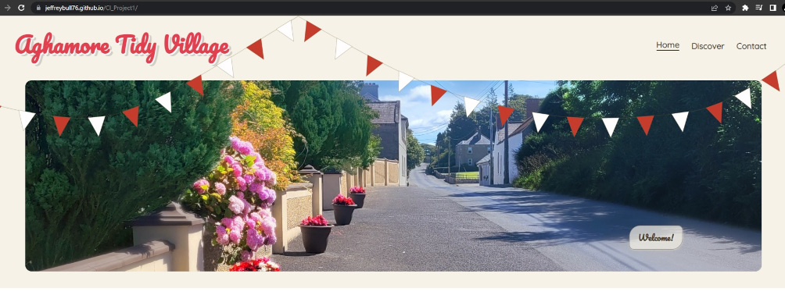

# Aghamore Tidy Village

The site is for a community group of volunteers and the organisation which helps keep their village tidy. 

Aghamore is a village in Mayo in the west of Ireland, and as with many rural village it is often overlooked by larger government bodies.  The Aghamore tidy village group seeks to rectify this by keeping the village, clean, tidy and well kept.  This site hopes to give a brief overview of the above, provide a gallery and a contact page for people to leave feedback.

The aim was to achieve a simple, retro styled yet modern website that was fully responsive whilst using no Javascript. Only pure HTML and CSS were used. Further to this the desire was to have slightly different layouts at various sizes in attempt to convey the same feeling regardless how it was viewed.

## Appearance of landing page on different devices

## Features

* ## Page Header

   * Contains a title with the groups name. This has been styled with offset shadow effects
   * On screen sizes above 820px in width consists of 3 buttons floated right with a simple animation when hovered. These show active page with an underline when clicked.
   * All elements are responsive at various sizes
   * The bunting (flags) effect is desinged to be asymmetrical, it shifts and scales at various screen sizes to remain in view but not to obscure anything vital.
   * Bunting was designed using inkscape by me.

* Hamburger menu

   * On screen sizes below 820px the buttons are removed from view and replaced a with simple hamburger style menu. As detailed above this is pure css no javascript was used.
   * This screen size was originally 768px but following feedback from industry professional it was increased to 820px to account for larger tablets.

--------------------------------

* ## Hero Image / Landing section

   * Image of Aghamores main street with welcome button.
   * Welcome button auto navigates to the text content below (mainly for use on mobiles)
   * This image is wide and expansive and not suited to harsh scaling. As such css that increases the size of the image without effecting the contained is used to convery the same feel at various sizes.
   * Image created in gimp from photo taken by me and then optimised with [tingpng.com](http://tinypng.com)

--------------------------------

* ## Main page content & footer section

   * Consists of 3 main content blocks created using Flex boxes
   * The content of these boxes has been styled to be responsive at shift justification at different screen sizes
   * Each section has descriptive text 4 corner graphics, and underline graphic and an icon (done with svgs and pngs respectively)
   * the footer seen at the bottom has basic copyright data and links to social media (mostly basic links to the main pages of each site in this case but added for example purpose) it is designed to site below the sites content regardless of flex boxes above.
   * The flow of this content was shifted following feedback from an industry professional. It now has the place information first and welcome / Intro message second.

--------------------------------

* ## Gallery page

   * Purpose of the page is to provide a grid based gallery that is fully responsive
   * Rather than shifting the layout the page merely responds by having each picture take up different amounts of rows and columns on resize
   * The images have a hover functionality which plays a short subtle flash animation to indicate interactivity
   * At higher than 1000px each image also has a subtle zoom effect on hover & click
   * Each image can be clicked to view in a larger format which then shows a caption. Clicking outside the image goes back to main gallery inline with expected function that most users will have experience of.
   * The page is built using pure css and html. The focus selector in CSS is used to zoom each image when clicked. When first implemented this resulted in ugly background shifts of the other images and unwanted interaction where clicking outside would result in a new image zoom rather than reverting the zoom. 
       * To fix this a background div was created that sits below all the content using z-index. On focus of an image this background div becomes visible and shifts up the z-index to cover everything, except the image that is zoomed and its respective caption.
       * This allows the user to click around the image without unwated interaction with the rest of the gallery, I did experiment with making this transparent but it was visually confusing.
    * Following feedback from an industry professional the zoom effect was removed from small screen devices as it was visually confusing.
    * Following feedback from a test user I had to remove the native 'lazy loading' tags in the html as they created a huge bug on Safari iOS 
    * Following feedback from an industry professional the gallery was edited to show less images on smaller devices to prevent excessive scrolling.
    

--------------------------------

* ## Contact page

   * Page has a simple form that allows users to post feedback with a rural background image (taken by me)